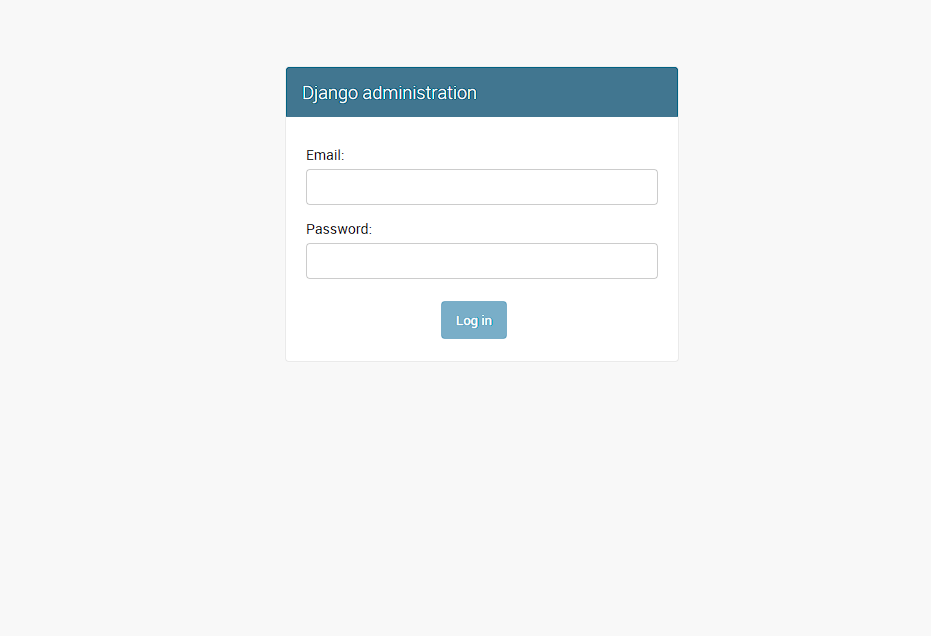

# Conduit

## Containerization of an Frontend and Backend application

This repository serves as a guide for containerizing a simple [Frontend](https://github.com/MarcelDechant/conduit-frontend) and associated [Backend](https://github.com/MarcelDechant/conduit-backend) application using **Docker Compose**.  
  
This Repository was created as part of my training at the **Developer Academy**.  

## Table of Contents

- [Conduit](#conduit)
  - [Containerization of an Frontend and Backend application](#containerization-of-an-frontend-and-backend-application)
  - [Table of Contents](#table-of-contents)
  - [Prerequisites](#prerequisites)
  - [Description](#description)
    - [The Conduit-Project](#the-conduit-project)
    - [Conduit combined in a container](#conduit-combined-in-a-container)
  - [Quickstart](#quickstart)
  - [Usage](#usage)
    - [Installation and Preparation](#installation-and-preparation)
    - [Containerization with Docker Compose](#containerization-with-docker-compose)
      - [The Files](#the-files)
      - [The Use](#the-use)
## Prerequisites

* **Docker** 24.0.7
  * **Compose** v2.32.4 (module to install, [More Information](https://docs.docker.com/compose/))

## Description

### The Conduit-Project

**Conduit** was created to demonstrate a fully fledged application built with Angular that interacts with an actual backend server including CRUD operations, authentication, routing, pagination, and more.  
  
It is a complete full-stack blogging system that serves as a reference implementation for various frontend and backend technologies. It is often used for educational purposes to show developers how a real application is built using modern technologies.  

It is provided free by [Thinkster](https://thinkster.io/) and is also known as the **RealWorld Example App**.

> [!TIP]
> If you want to learn more about the [Frontend](https://github.com/MarcelDechant/conduit-frontend) and [Backend](https://github.com/MarcelDechant/conduit-backend) app or try them both individually, check out their repositories.

### Conduit combined in a container

Often the frontend and backend are hosted on different servers. A clear option is to host both together in a container. Here is a way to make it work.

## Quickstart

This section provides a fast and **minimal setup guide** for using the tools in this repository. For a more **in-depth understanding** and additional options, please refer to the [Usage](#usage) section.

1. [Clone](https://docs.github.com/en/repositories/creating-and-managing-repositories/cloning-a-repository) the project to your platform manually:
    * Example: Clone the repo e.g. using an SSH-Key:  

    ```bash
    git clone git@github.com:MarcelDechant/Conduit.git
    ```

2. Init and update the **submodules**:

    ```bash
    git submodule init
    git submodule update
    ```

3. Configure the **environment variables**:
    * Copy the content of the [`example.env`](example.env) file into an .env file.

    * The new `.env` file should contain all the environment variables - **all of them are required** to run the frontend and backend application!

4. **Build and start the containers** in the background (detached mode):

    ```bash
    docker compose up --build -d
    ```

5. Check whether the **containers are running** correctly:

* Browse to your **IP_ADDRESS:8282** to open the `Frontend`, you should see something like this:
    

* Browse to your **IP_ADDRESS:8383/admin** to open the `Backend`, you should see this:
    

## Usage

### Installation and Preparation

1. [Clone](https://docs.github.com/en/repositories/creating-and-managing-repositories/cloning-a-repository) the project to your platform if you just want to use it:
    * Example: Clone the repo e.g. using an SSH-Key:  

    ```bash
    git clone git@github.com:MarcelDechant/Conduit.git
    ```

2. Init and update the **submodules**:

    ```bash
    git submodule init
    git submodule update
    ```
1. Configure the **environment variables**:
    * Copy the content of the [`example.env`](example.env) file into an .env file. It should contain all the environment variables - **all of them are required** to run the frontend and backend application:

    | Variable | Description | Type | Default Value |
    | -------- | ----------- | ---- | ------------- |
    | **Used in backend application** | | | |
    | SECRET_KEY | Essential cryptographic key used by Django to protect sensitive data and provide security-critical functionality | string | secret |
    | DEBUG | Set False for production mode | boolean | True |
    | ALLOWED_HOSTS | Comma-separated list of hostnames or IP addresses that are allowed to connect to the Django server | string |localhost,127.0.0.1 |
    | CORS_ORIGIN_WHITELIST | List of all hosts with their portnumbers, added to settings.py | string | "127.0.0.1:8282,localhost:8282" |
    | DJANGO_SUPERUSER_USERNAME | Username to create a superuser for the admin panel | string | admin |
    | DJANGO_SUPERUSER_EMAIL | Email address to create a superuser for the admin panel | string | admin@test.de |
    | DJANGO_SUPERUSER_PASSWORD | Password to create a superuser for the admin panel | string | changeMe123 |
    | **Used in frontend application** | | | |
    | API_URL | Adds backend URL to environment.prod.ts, used in app/core/interceptors/api.interceptor.ts | string | http://127.0.0.1:8383/api |
    | **Used for containerization** | | | |
    | BACKEND_EXTERNAL_PORT | External portnumber for backend-container | string | 8383 |
    | FRONTEND_EXTERNAL_PORT | External portnumber for frontend-container | string | 8282 |

### Containerization with Docker Compose

#### The Files

1. One service each is created for the frontend and the backend application. The [`compose.yaml`](compose.yaml) is responsible for managing and orchestrating the frontend and backend container. It defines what configurations they should have.

> [!NOTE]
> The file is adapted for automatic deployment. For this manual deployment setup, the `image blocks` in the services must be exchanged for the `build blocks`, as noted in the file.

2. The [`Frontend-Dockerfile`](conduit-frontend/Dockerfile) describes how a single Docker image for the frontend-container should be created.

3. Also the [`Backend-Dockerfile`](conduit-backend/Dockerfile) serves as the basis for the corresponding service in the Docker Compose file.
   
4. The [`entrypoint.sh`](conduit-backend/entrypoint.sh) is used in combination with the backend's Dockerfile to initialize and configure the backend-container and executing the main command.

#### The Use

1. **Build and start the containers** in the background (detached mode):

    ```bash
    docker compose up --build -d
    ```

    * To save the log files:

        ```bash
        docker logs <container-name> > backend-log.txt
        ```

        * Example for backend-container:

        ```bash
        docker logs conduit-backend > backend-log.txt
        ```

1. Check whether the **containers are running** correctly:

* Browse to your **IP_ADDRESS:8282** to open the `Frontend`, you should see something like this:
    

* Browse to your **IP_ADDRESS:8383/admin** to open the `Backend`, you should see this:
    

> [!NOTE]
> It is possible that not all features of the conduit app are working properly. It may be that paths for certain API endpoints in various frontend services need to be adjusted.